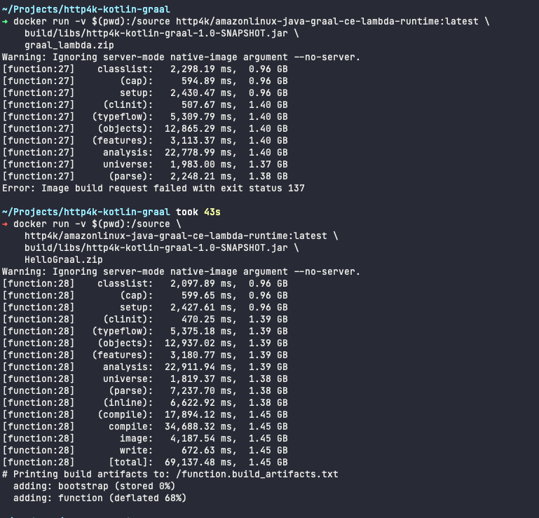
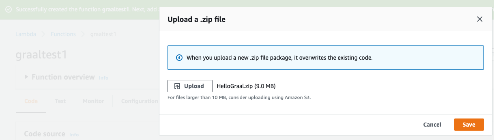
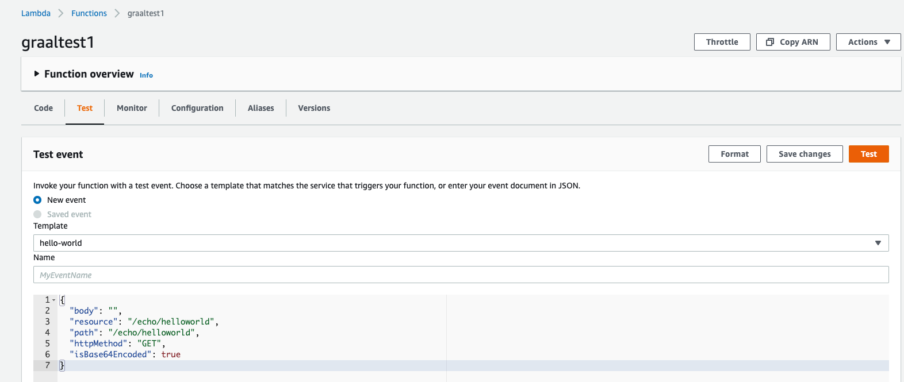
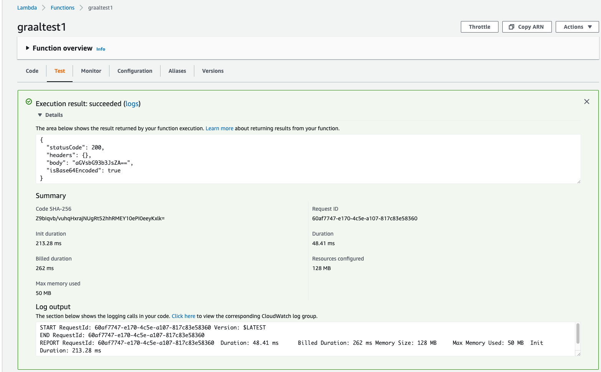
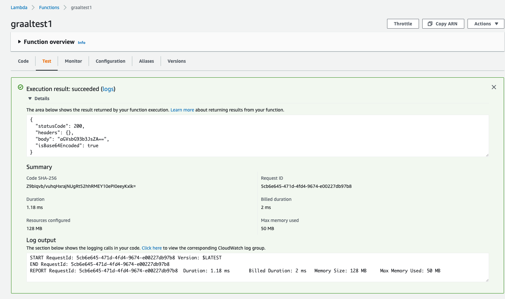

# http4k + kotlin + graal

A very simple hello world type AWS lambda in Kotlin which compiles with Graal.

Purpose of this was to benchmark cold and warm start times on AWS Lambda and explore the build process.

Since there are dozens of ways to get a lambda deployed to AWS (often specific to a company's tooling and even different team to team) this just documents the manual way. An exercise left to the reader.

## Requirements
* docker - as graalvm image is needed for compilation
* intellij - or whatever IDE you want to edit the 24 lines of Kotlin code :)
* gradle - gradle wrapper is included however
* java (8 at least) - for the build step as we are using kotlin jvm

## Building

```shell
cd ~/Projects/http4k-kotlin-graal/
./gradlew clean build shadowJar
```

This cleans, builds and runs tests (none in this demo) and packages it into a jar in `build/libs/`

## Compiling

```shell
docker run -v $(pwd):/source http4k/amazonlinux-java-graal-ce-lambda-runtime:latest \
    build/libs/http4k-kotlin-graal-1.0-SNAPSHOT.jar \
    graal_lambda.zip
```

This might take some time and plenty of ram on your computer (and or fail randomly as it runs out of memory)


## Deploying to AWS Lambda

There are dozens of ways to deploy, but for sake of simplicity here is how to do it using the aws console





## Checking in AWS Lambda console

Select Test and paste this basic request

```json
{
  "body": "",
  "resource": "/echo/helloworld",
  "path": "/echo/helloworld",
  "httpMethod": "GET",
  "isBase64Encoded": true
}
```

On a cold start with 128MB allocated the init duration is 212ms and lambda duration is 48ms (which is quite a bit lower than JVM lambdas with 2-3s start times)




On subsequent (hot) requests it gets better with 1ms init and 2ms run!



That's pretty much all there is too it, will try to make a more complicated example with dynamodb or something time permitting in the future.